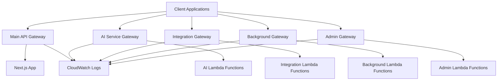

# API Gateway for Microservices Architecture

This document describes the enhanced API Gateway configuration for the Bayon CoAgent microservices architecture. The API Gateway provides service boundaries, request routing, authentication, throttling, and monitoring for the distributed system.

## Overview

The API Gateway enhancement creates separate API Gateway instances for each service boundary:

1. **Main API Gateway** - Core platform service (Next.js + API Routes)
2. **AI Service API Gateway** - AI processing and Bedrock operations
3. **Integration Service API Gateway** - External integrations (MLS, OAuth, social media)
4. **Background Service API Gateway** - Analytics, notifications, scheduled tasks
5. **Admin Service API Gateway** - Administrative functions and monitoring

## Architecture



## Features

### Service Boundaries

Each API Gateway provides clear service boundaries with:

- **Dedicated endpoints** for each service
- **Independent scaling** and throttling
- **Service-specific monitoring** and alerting
- **Isolated failure domains**

### API Versioning

- **Version-aware routing** (v1, v2, etc.)
- **Backward compatibility** support
- **Deprecation management** with warnings
- **Gradual migration** capabilities

### Request/Response Transformation

- **Standardized error responses** with trace IDs
- **Request validation** with JSON schemas
- **CORS configuration** for web clients
- **Security headers** (OWASP compliance)

### Throttling and Usage Plans

Multiple usage tiers with different limits:

- **Basic Tier**: 100 req/sec, 10K req/day
- **Premium Tier**: 500 req/sec, 50K req/day
- **Enterprise Tier**: 2000 req/sec, 200K req/day
- **Service-specific limits** for AI and integration services

### Custom Domain Support

- **SSL/TLS termination** with ACM certificates
- **Route53 integration** for DNS management
- **Service-specific subdomains** (ai-api.domain.com)
- **Regional endpoints** for better performance

## Configuration

### Environment Variables

The API Gateway configuration uses these environment variables:

```bash
# API Gateway URLs (auto-generated by deployment)
MAIN_API_URL=https://api-id.execute-api.region.amazonaws.com/environment
AI_SERVICE_API_URL=https://ai-api-id.execute-api.region.amazonaws.com/v1
INTEGRATION_SERVICE_API_URL=https://int-api-id.execute-api.region.amazonaws.com/v1
BACKGROUND_SERVICE_API_URL=https://bg-api-id.execute-api.region.amazonaws.com/v1
ADMIN_SERVICE_API_URL=https://admin-api-id.execute-api.region.amazonaws.com/v1

# API Gateway IDs (for AWS SDK usage)
MAIN_REST_API_ID=api-id
AI_SERVICE_API_ID=ai-api-id
INTEGRATION_SERVICE_API_ID=int-api-id
BACKGROUND_SERVICE_API_ID=bg-api-id
ADMIN_SERVICE_API_ID=admin-api-id

# AWS Configuration
AWS_REGION=us-east-1
ENVIRONMENT=development
```

### Usage in Code

```typescript
import { getApiClient, get, post } from "@/aws/api-gateway";

// Using the client directly
const client = getApiClient();
const response = await client.ai({
  method: "POST",
  path: "/generate/blog-post",
  body: { topic: "Real Estate Market Trends" },
});

// Using convenience functions
const aiResponse = await post("ai", "/generate/blog-post", {
  topic: "Real Estate Market Trends",
});

const healthCheck = await get("main", "/health");
```

## Deployment

### Using the Deployment Script

```bash
# Development deployment
./scripts/deploy-api-gateway.sh --environment development

# Production deployment with custom domain
./scripts/deploy-api-gateway.sh \
  --environment production \
  --region us-west-2 \
  --domain api.bayoncoagent.com \
  --certificate-arn arn:aws:acm:us-west-2:123456789012:certificate/12345678-1234-1234-1234-123456789012
```

### Manual SAM Deployment

```bash
# Build the application
sam build

# Deploy with parameters
sam deploy \
  --stack-name bayon-coagent-production \
  --region us-west-2 \
  --capabilities CAPABILITY_IAM \
  --parameter-overrides Environment=production \
  --no-fail-on-empty-changeset
```

## Monitoring and Observability

### CloudWatch Metrics

Each API Gateway automatically publishes metrics:

- **Request count** and **error rates**
- **Latency** (p50, p95, p99)
- **Throttling** events
- **Cache hit/miss** ratios

### CloudWatch Alarms

Automatic alarms for:

- **4XX error rate** > threshold
- **5XX error rate** > threshold
- **Latency** > threshold
- **Throttling** events

### Access Logs

Structured JSON logs include:

- **Request ID** and **trace ID**
- **Client IP** and **user agent**
- **Request/response** details
- **Timing** information
- **Error** details

### X-Ray Tracing

Distributed tracing across:

- **API Gateway** requests
- **Lambda** function execution
- **DynamoDB** operations
- **External** API calls

## Security

### Authentication

- **Cognito User Pool** integration
- **JWT token** validation
- **IAM** role-based access
- **API key** authentication (optional)

### Authorization

- **Resource-based** policies
- **Method-level** permissions
- **User context** extraction
- **Role-based** access control

### Network Security

- **HTTPS only** (TLS 1.2+)
- **CORS** configuration
- **Security headers** (HSTS, CSP, etc.)
- **Rate limiting** and **DDoS protection**

## Error Handling

### Standardized Error Format

```json
{
  "error": {
    "code": "VALIDATION_ERROR",
    "message": "Invalid request parameters",
    "details": {
      "field": "email",
      "reason": "Invalid email format"
    },
    "traceId": "trace-1234567890-abcdef"
  }
}
```

### Error Codes

- **BAD_REQUEST** (400) - Invalid request
- **UNAUTHORIZED** (401) - Authentication required
- **FORBIDDEN** (403) - Access denied
- **NOT_FOUND** (404) - Resource not found
- **RATE_LIMITED** (429) - Too many requests
- **INTERNAL_ERROR** (500) - Server error
- **SERVICE_UNAVAILABLE** (503) - Service down

### Circuit Breaker Pattern

- **Automatic failover** to cached responses
- **Graceful degradation** when services are down
- **Health checks** for service availability
- **Retry logic** with exponential backoff

## Performance Optimization

### Caching

- **Response caching** for GET requests
- **TTL-based** cache invalidation
- **Cache key** customization
- **Cache hit** metrics

### Compression

- **GZIP compression** for responses
- **Content-Type** based compression
- **Size threshold** configuration

### Connection Pooling

- **Keep-alive** connections
- **Connection reuse** for Lambda
- **Timeout** configuration

## Testing

### Health Checks

```typescript
import { checkAllServicesHealth } from "@/aws/api-gateway";

const healthResults = await checkAllServicesHealth();
console.log("Service Health:", healthResults);
```

### Load Testing

```bash
# Install artillery for load testing
npm install -g artillery

# Run load test
artillery run load-test-config.yml
```

### Integration Testing

```typescript
import { getApiClient } from "@/aws/api-gateway";

describe("API Gateway Integration", () => {
  it("should handle AI service requests", async () => {
    const client = getApiClient();
    const response = await client.ai({
      method: "POST",
      path: "/health",
    });

    expect(response.success).toBe(true);
    expect(response.statusCode).toBe(200);
  });
});
```

## Migration Strategy

### Phase 1: Infrastructure Setup

1. Deploy API Gateway infrastructure
2. Configure monitoring and alerting
3. Set up custom domains (if applicable)
4. Test basic connectivity

### Phase 2: Service Migration

1. **AI Service**: Move Bedrock operations to Lambda
2. **Integration Service**: Move OAuth and external APIs
3. **Background Service**: Move scheduled tasks
4. **Admin Service**: Move administrative functions

### Phase 3: Traffic Migration

1. **Gradual rollout** with feature flags
2. **A/B testing** between old and new endpoints
3. **Monitoring** for performance and errors
4. **Rollback** capability if issues arise

### Phase 4: Cleanup

1. Remove old API routes from Next.js
2. Update client applications
3. Decommission unused resources
4. Update documentation

## Troubleshooting

### Common Issues

1. **CORS Errors**

   - Check origin configuration
   - Verify headers and methods
   - Test with browser dev tools

2. **Authentication Failures**

   - Verify JWT token format
   - Check token expiration
   - Validate Cognito configuration

3. **Rate Limiting**

   - Check usage plan limits
   - Monitor throttling metrics
   - Adjust limits if needed

4. **High Latency**
   - Check Lambda cold starts
   - Monitor downstream services
   - Optimize database queries

### Debugging Tools

```bash
# Check API Gateway logs
aws logs filter-log-events \
  --log-group-name /aws/apigateway/bayon-coagent-production \
  --start-time $(date -d '1 hour ago' +%s)000

# Test endpoint directly
curl -X GET \
  -H "Authorization: Bearer $JWT_TOKEN" \
  -H "Content-Type: application/json" \
  https://api-id.execute-api.us-east-1.amazonaws.com/production/health

# Check CloudWatch metrics
aws cloudwatch get-metric-statistics \
  --namespace AWS/ApiGateway \
  --metric-name Count \
  --dimensions Name=ApiName,Value=bayon-coagent-main-production \
  --start-time $(date -d '1 hour ago' --iso-8601) \
  --end-time $(date --iso-8601) \
  --period 300 \
  --statistics Sum
```

## Best Practices

### API Design

- Use **RESTful** conventions
- Implement **consistent** error handling
- Provide **comprehensive** documentation
- Version APIs **proactively**

### Security

- Always use **HTTPS**
- Implement **proper** authentication
- Validate **all** inputs
- Log **security** events

### Performance

- Cache **frequently** accessed data
- Minimize **payload** sizes
- Use **compression** for large responses
- Monitor **performance** metrics

### Monitoring

- Set up **comprehensive** alerting
- Track **business** metrics
- Monitor **user** experience
- Implement **distributed** tracing

## Next Steps

1. **Deploy Lambda functions** for each service boundary
2. **Configure API Gateway integrations** with Lambda
3. **Set up monitoring dashboards** in CloudWatch
4. **Implement circuit breaker patterns** for resilience
5. **Add custom domains** for production environments
6. **Create API documentation** for each service
7. **Set up automated testing** for API endpoints
8. **Implement blue-green deployments** for zero downtime
