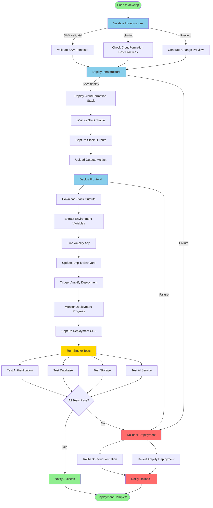
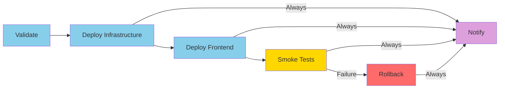
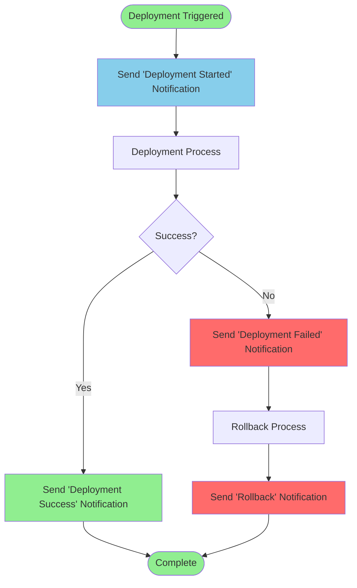
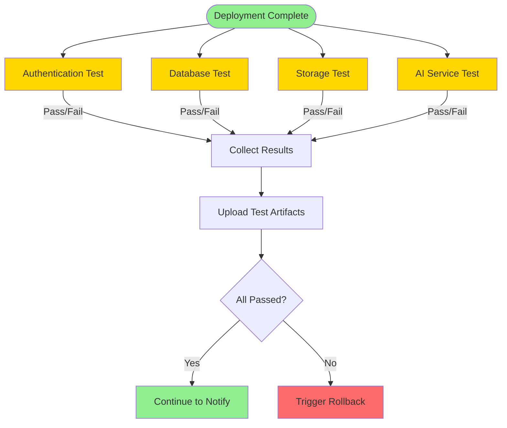
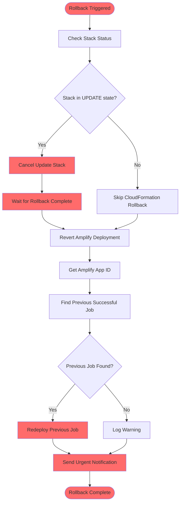
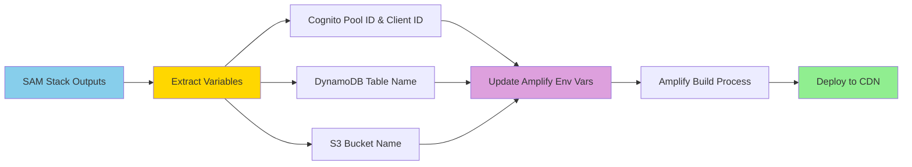
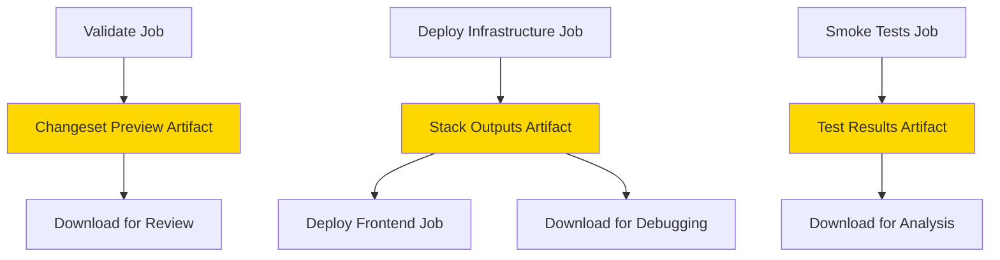
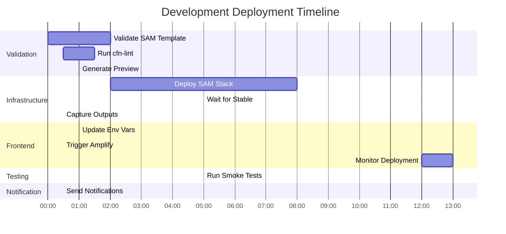

# CI/CD Deployment Flow Diagram

## Development Deployment Workflow

## Job Dependencies

## Notification Flow

## Smoke Test Execution

## Rollback Process

## Environment Variables Flow

## Artifact Flow

## Timeline

## Legend

- 🟢 **Green**: Success states
- 🔵 **Blue**: Processing/In-progress states
- 🟡 **Yellow**: Testing/Validation states
- 🔴 **Red**: Failure/Rollback states
- 🟣 **Purple**: Notification states

## Notes

1. **Parallel Execution**: Some steps within jobs run in parallel (e.g., validation checks)
2. **Conditional Execution**: Rollback only runs on failure
3. **Always Execution**: Notify job always runs regardless of success/failure
4. **Artifact Retention**:
   - Changeset Preview: 7 days
   - Stack Outputs: 30 days
   - Test Results: 30 days
