# Performance Testing Workflow Flow Diagram

## Overview Flow

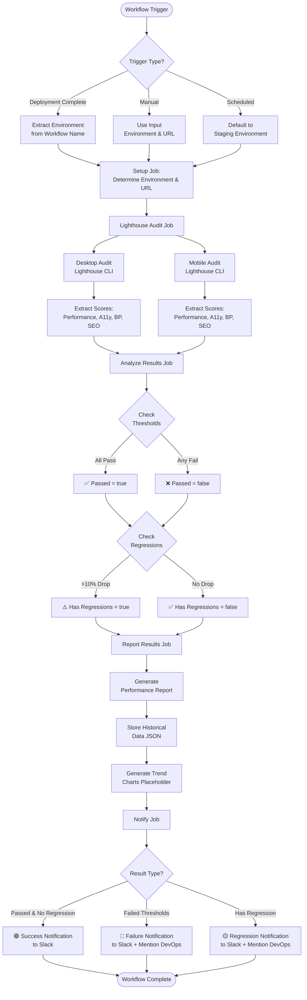

## Detailed Job Flow

### Setup Job

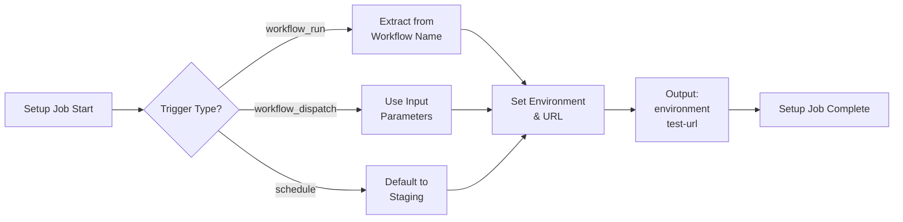

### Lighthouse Audit Job (Matrix)

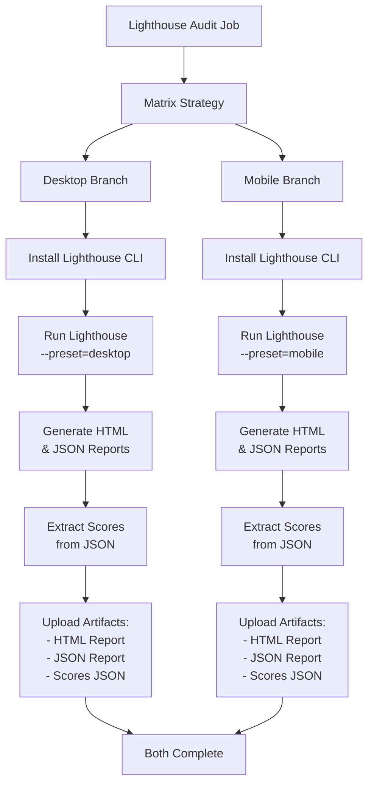

### Analyze Results Job

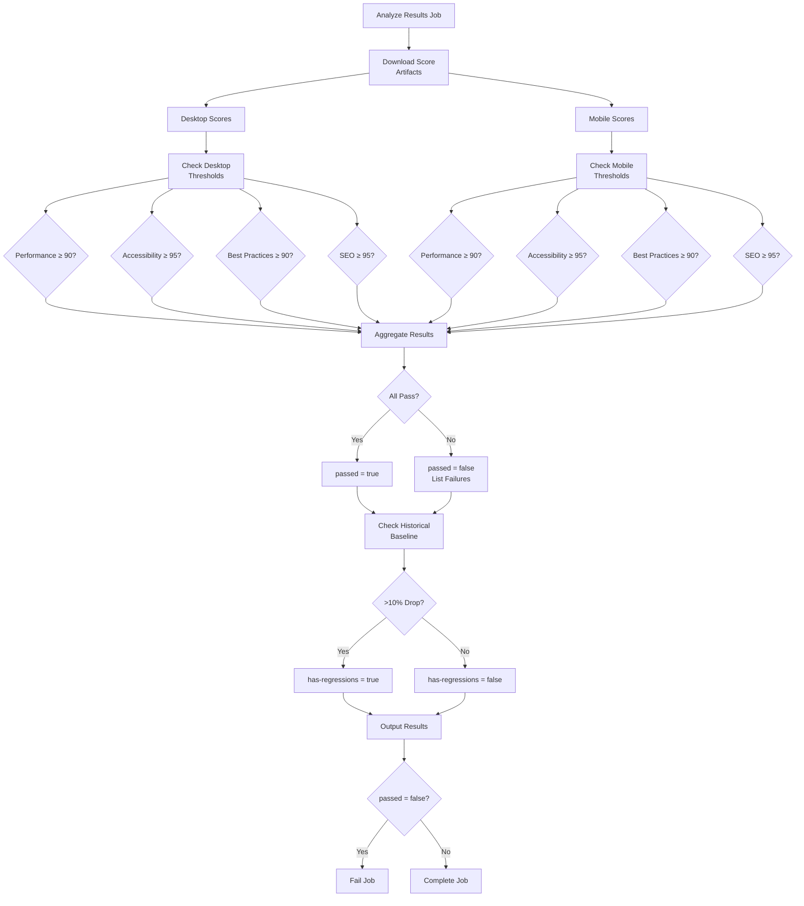

### Report Results Job

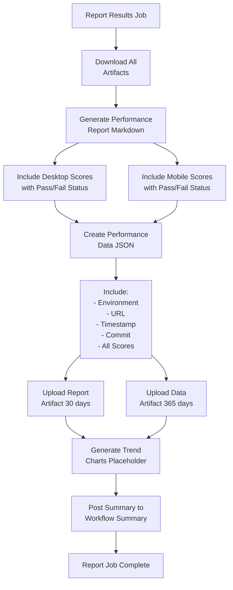

### Notify Job

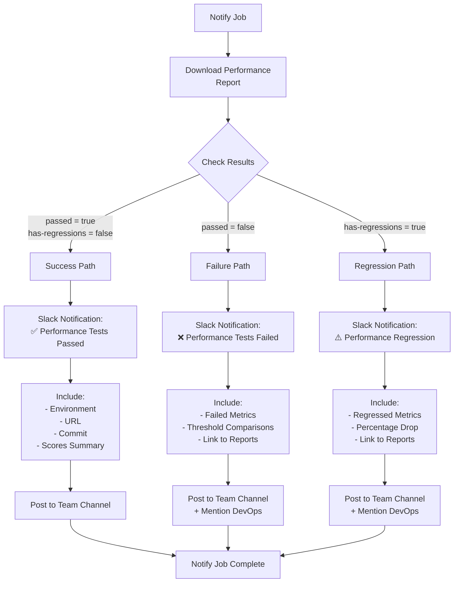

## Trigger Scenarios

### Scenario 1: After Staging Deployment

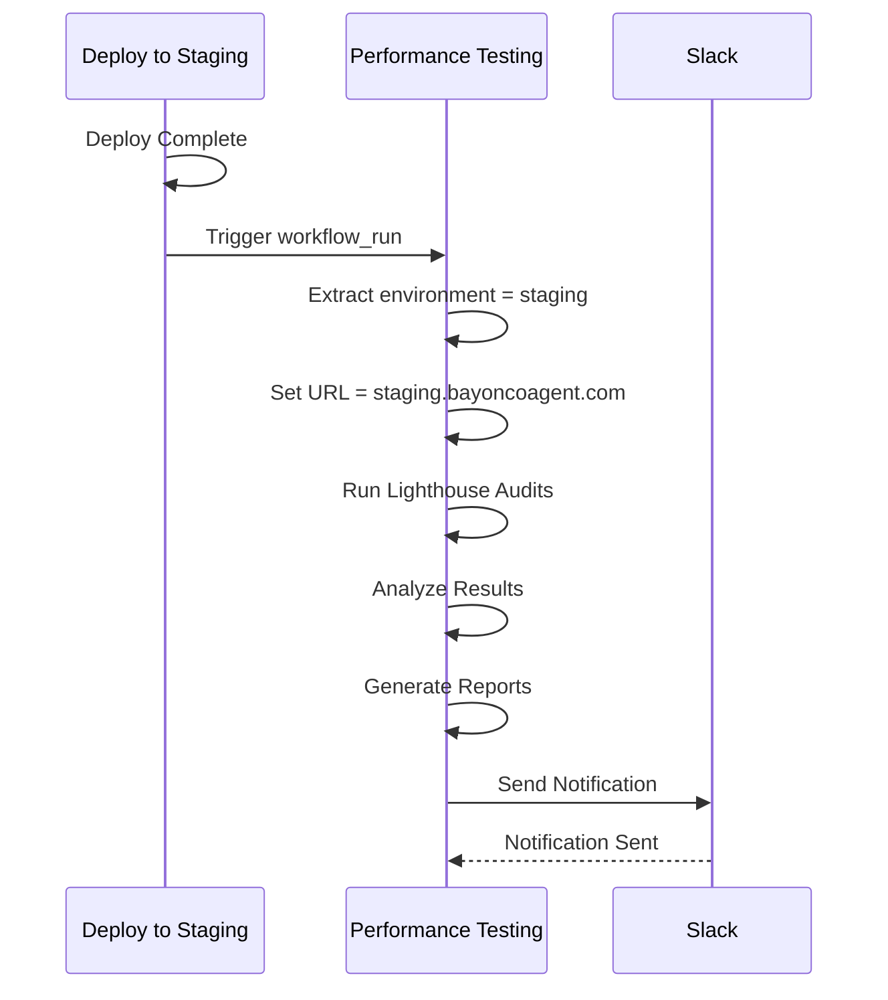

### Scenario 2: Manual Trigger

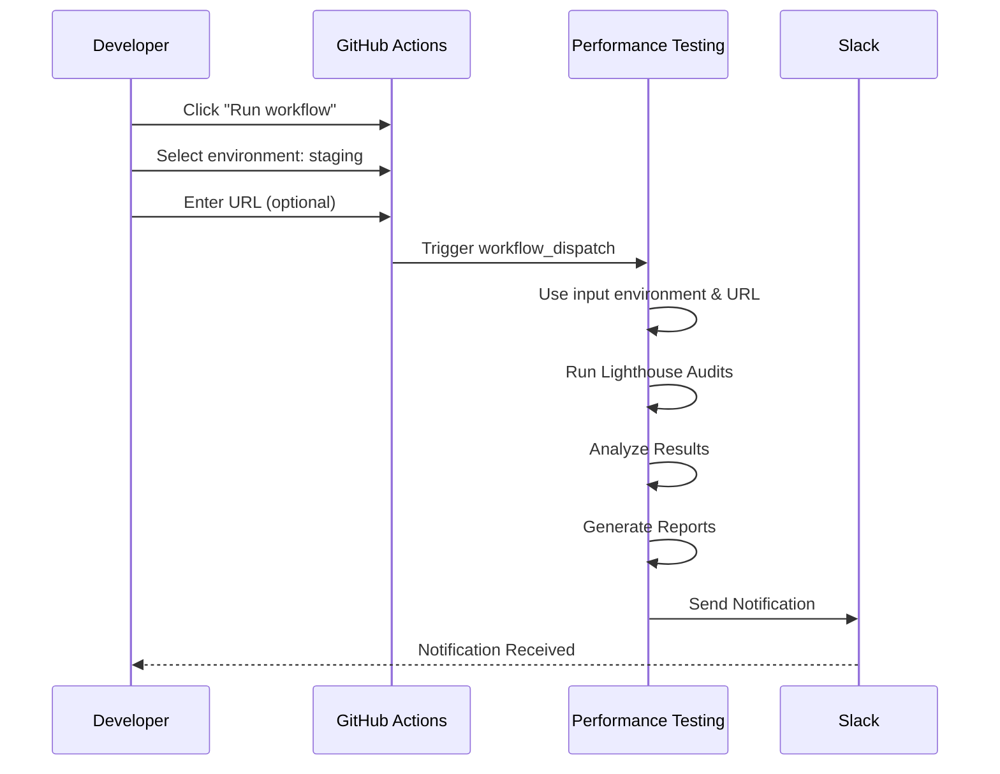

### Scenario 3: Scheduled Run

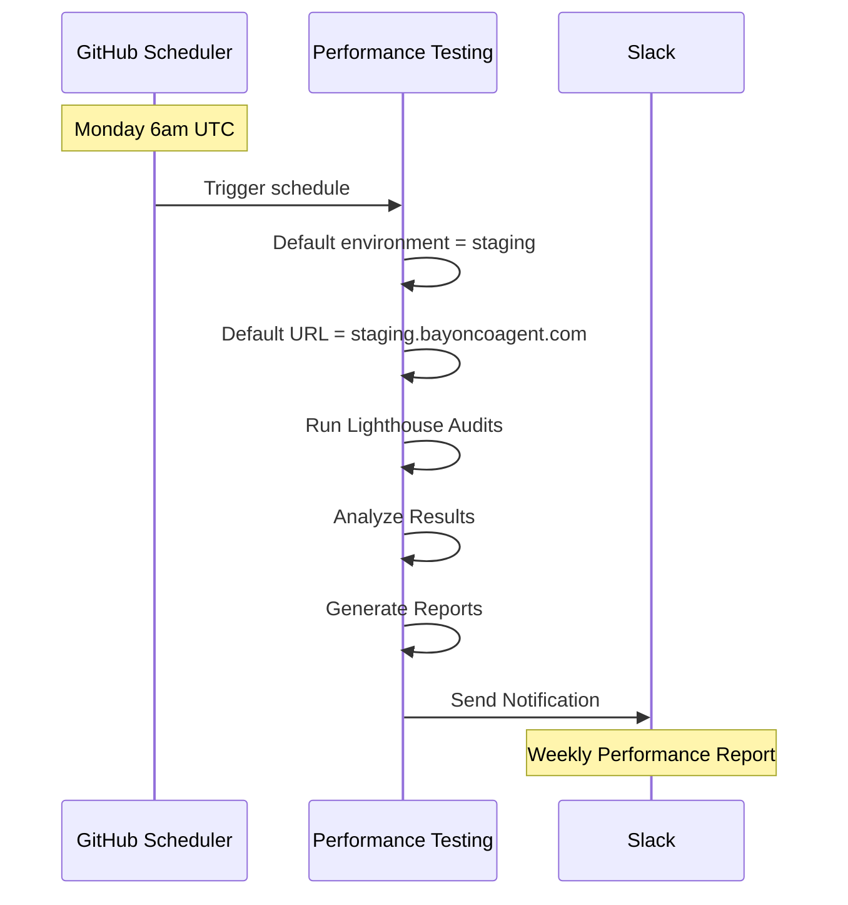

## Data Flow

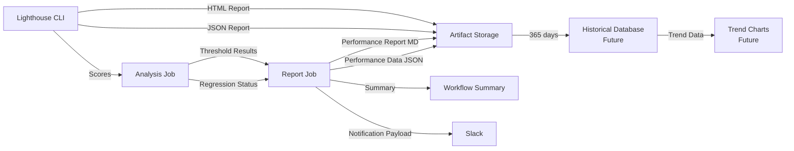

## Artifact Retention

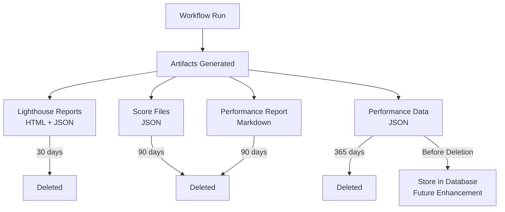

## Threshold Checking Logic

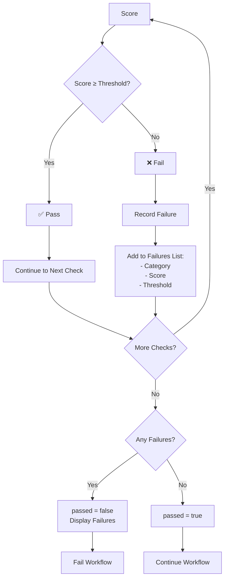

## Regression Detection Logic

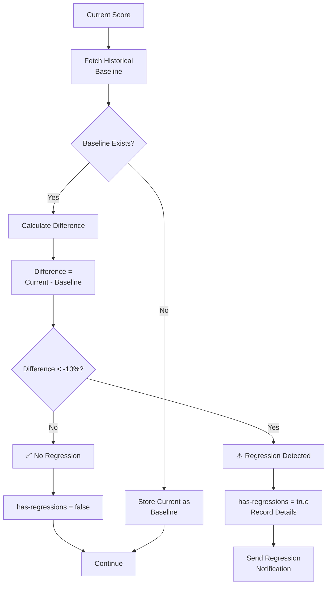

## Complete Workflow Timeline

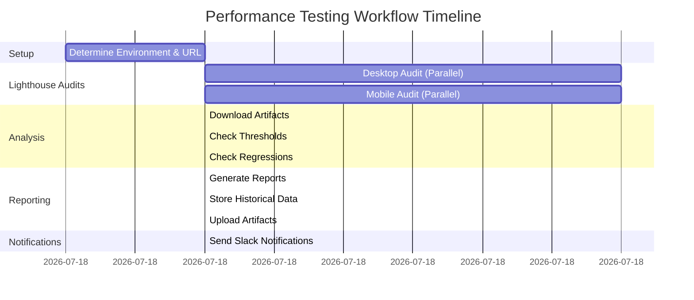

**Total Estimated Time**: ~6 minutes

## Legend

- 🟢 Success Path
- 🔴 Failure Path
- 🟡 Warning Path
- ✅ Pass Condition
- ❌ Fail Condition
- ⚠️ Regression Detected
- 📊 Data Storage
- 🔔 Notification
