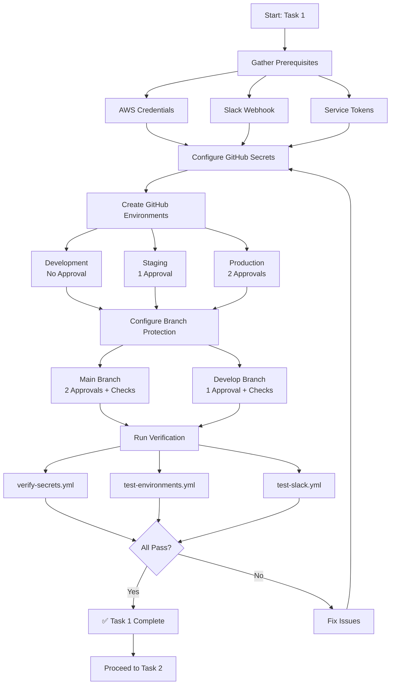
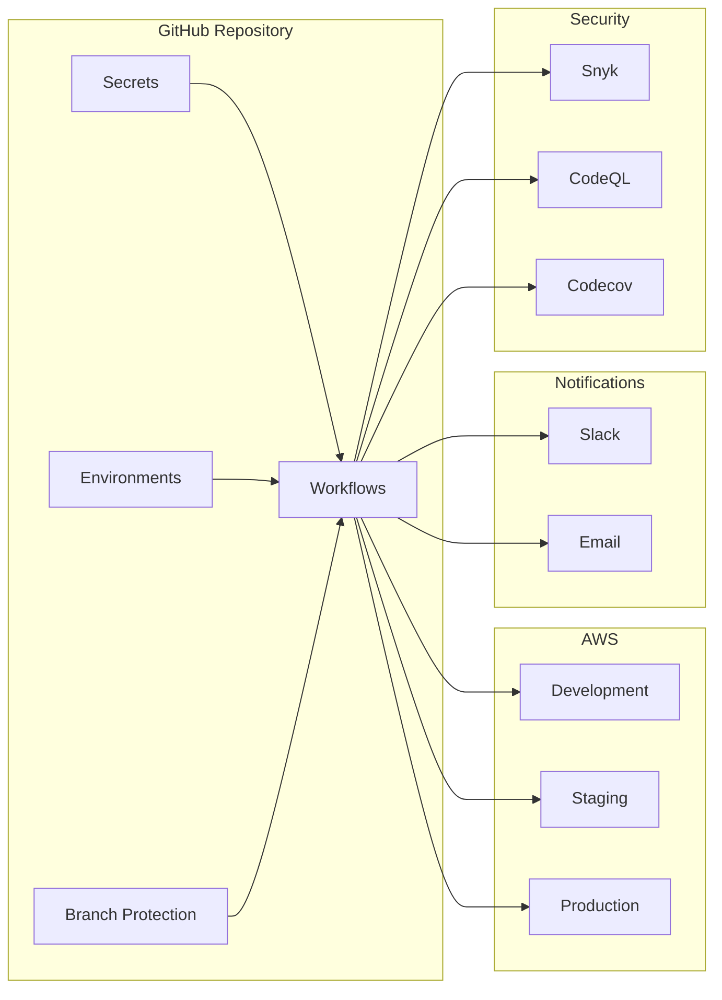
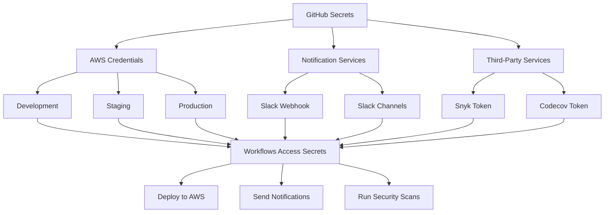
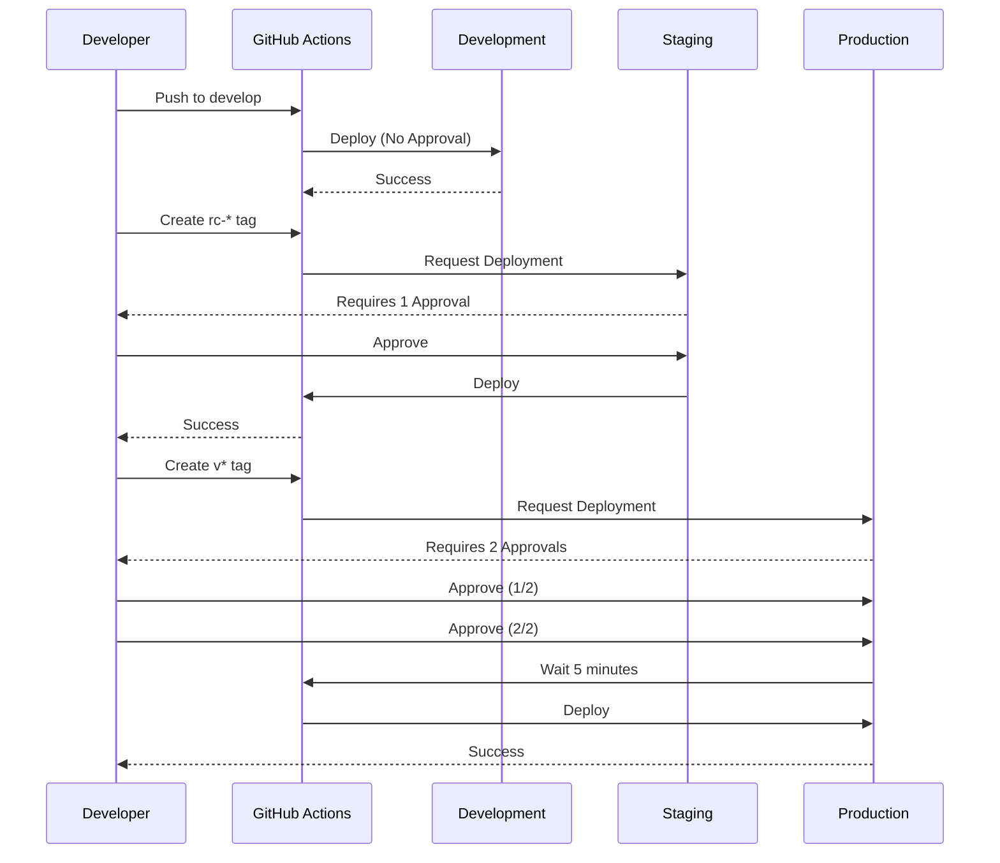
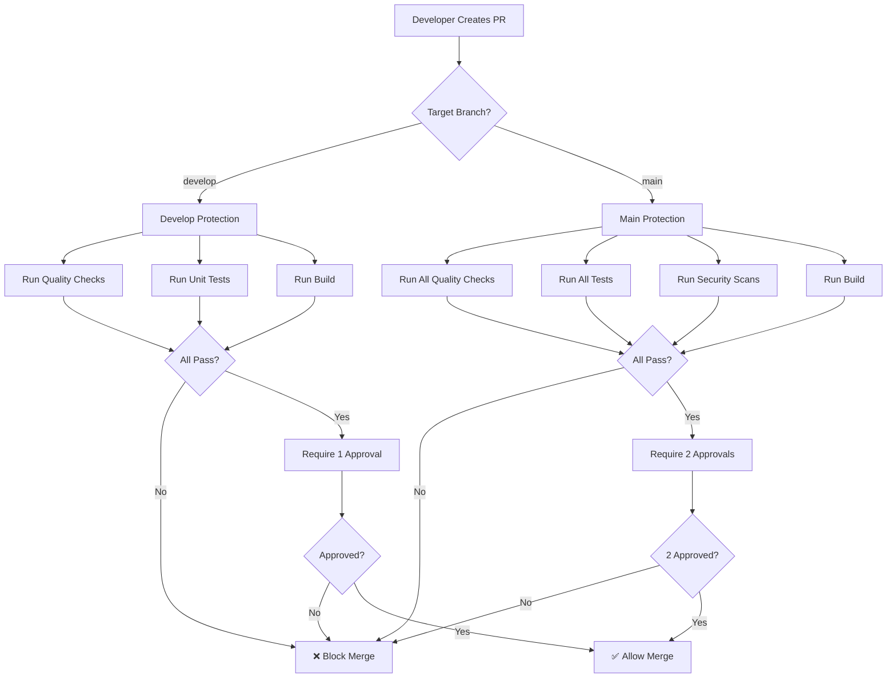
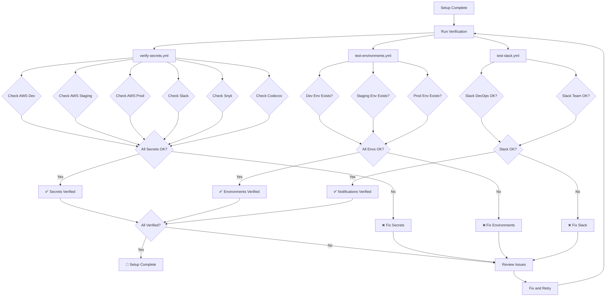
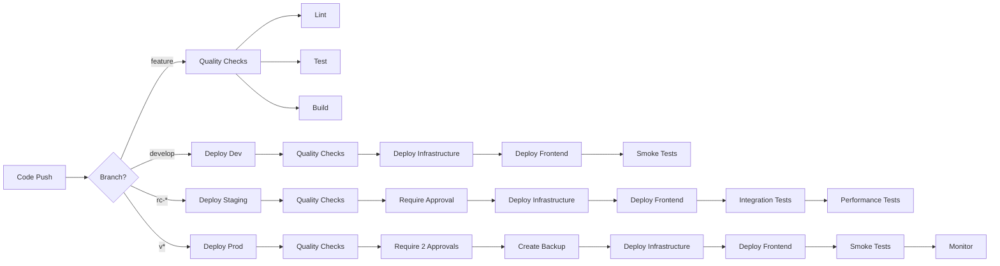
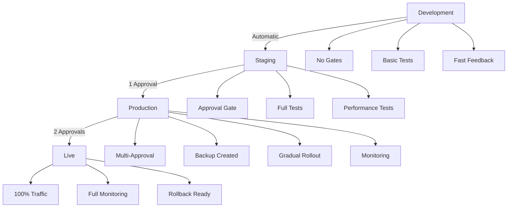
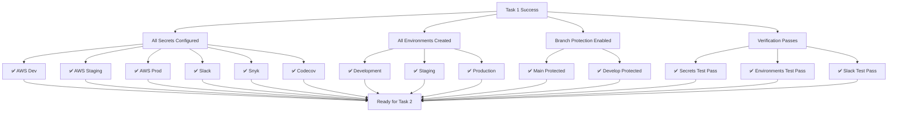

# CI/CD Setup Flow Diagram

Visual guide for understanding the GitHub repository setup process.

## 🔄 Setup Flow

## 🏗️ Architecture Overview

## 🔐 Secrets Configuration Flow

## 🌍 Environment Approval Flow

## 🛡️ Branch Protection Flow

## 📊 Verification Process

## 🔄 Deployment Pipeline Overview

## 📈 Progressive Deployment Strategy

## 🎯 Success Criteria

---

## 📝 How to Use These Diagrams

1. **Setup Flow**: Follow this for the overall process
2. **Architecture Overview**: Understand how components connect
3. **Secrets Configuration**: See how secrets flow to workflows
4. **Environment Approval**: Understand approval requirements
5. **Branch Protection**: See how PRs are validated
6. **Verification Process**: Follow the testing flow
7. **Deployment Pipeline**: Preview the full CI/CD flow
8. **Progressive Deployment**: Understand the deployment strategy
9. **Success Criteria**: Checklist for completion

---

**Note**: These diagrams use Mermaid syntax and will render in GitHub, VS Code with Mermaid extension, or any Markdown viewer that supports Mermaid.
