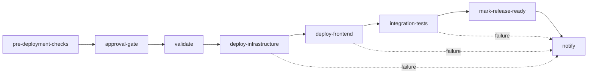
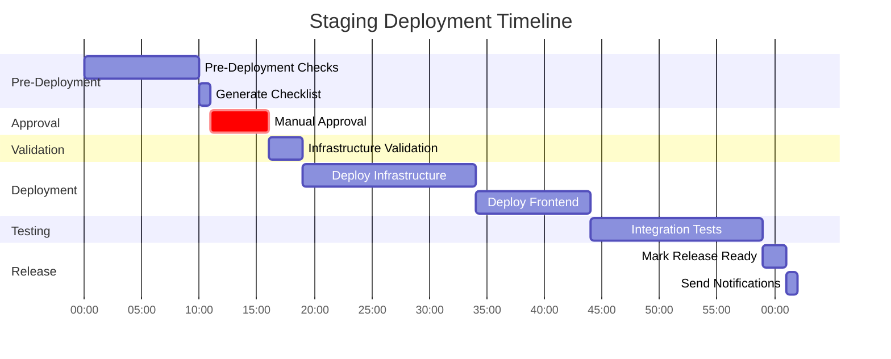
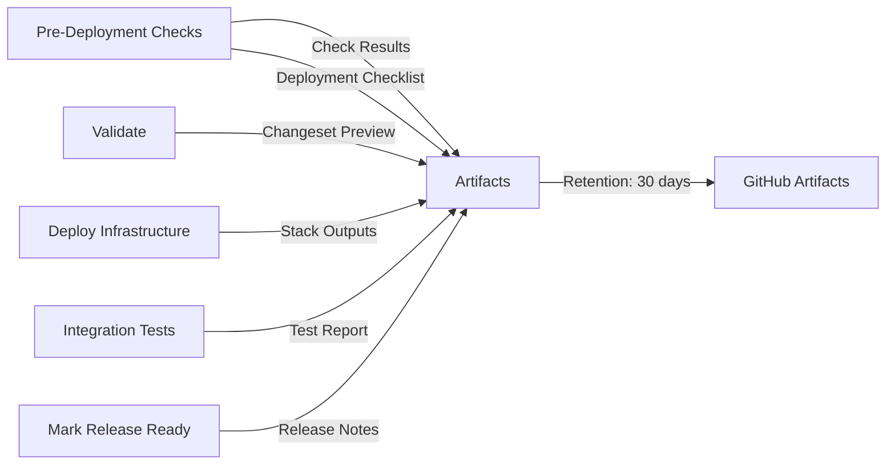
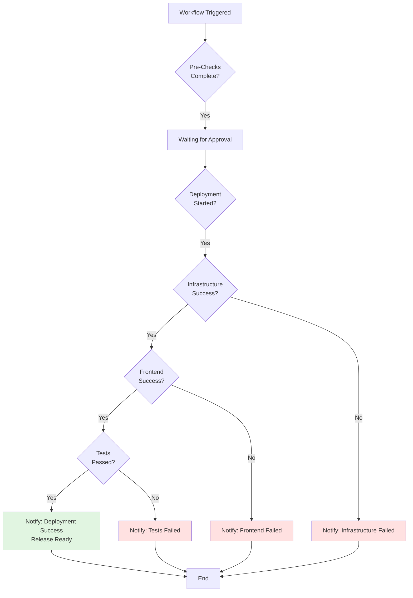
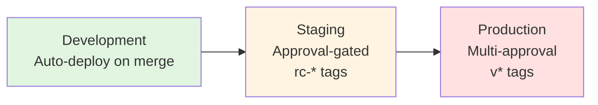

# Staging Deployment Flow Diagram

## Overview

This diagram shows the complete flow of the staging deployment workflow, including all jobs, dependencies, and decision points.

## Workflow Diagram

```mermaid
graph TB
    Start([Tag Push: rc-*<br/>or Manual Trigger]) --> PreChecks

    subgraph "Pre-Deployment Phase"
        PreChecks[Pre-Deployment Checks<br/>5-10 minutes]
        PreChecks --> ESLint[Run ESLint]
        PreChecks --> TypeCheck[Run TypeScript]
        PreChecks --> Tests[Run Unit Tests]
        PreChecks --> Security[Run Security Scan]

        ESLint --> Checklist[Generate Checklist]
        TypeCheck --> Checklist
        Tests --> Checklist
        Security --> Checklist
    end

    Checklist --> Approval

    subgraph "Approval Phase"
        Approval{Manual Approval<br/>Required<br/>Timeout: 24h}
        Approval -->|Approved| Validate
        Approval -->|Timeout/Rejected| End1([Workflow Cancelled])
    end

    subgraph "Validation Phase"
        Validate[Validate Infrastructure<br/>2-3 minutes]
        Validate --> SAMValidate[SAM Validate]
        Validate --> CFNLint[cfn-lint]
        Validate --> ChangePreview[Generate Change Preview]
    end

    ChangePreview --> DeployInfra

    subgraph "Infrastructure Deployment"
        DeployInfra[Deploy Infrastructure<br/>10-15 minutes]
        DeployInfra --> SAMDeploy[SAM Deploy]
        SAMDeploy --> WaitStack[Wait for Stack Stable]
        WaitStack --> CaptureOutputs[Capture Stack Outputs]
    end

    CaptureOutputs --> DeployFrontend

    subgraph "Frontend Deployment"
        DeployFrontend[Deploy Frontend<br/>5-10 minutes]
        DeployFrontend --> ExtractVars[Extract Env Vars]
        ExtractVars --> UpdateAmplify[Update Amplify Config]
        UpdateAmplify --> TriggerAmplify[Trigger Amplify Deploy]
        TriggerAmplify --> MonitorAmplify[Monitor Progress]
        MonitorAmplify --> CaptureURL[Capture Deployment URL]
    end

    CaptureURL --> IntegrationTests

    subgraph "Integration Testing"
        IntegrationTests[Integration Tests<br/>10-15 minutes]
        IntegrationTests --> TestAuth[Test Auth Flows]
        IntegrationTests --> TestContent[Test Content Creation]
        IntegrationTests --> TestOAuth[Test OAuth]
        IntegrationTests --> TestAI[Test AI Services]

        TestAuth --> TestResults{All Tests<br/>Passed?}
        TestContent --> TestResults
        TestOAuth --> TestResults
        TestAI --> TestResults
    end

    TestResults -->|Yes| MarkReady
    TestResults -->|No| NotifyFail

    subgraph "Release Management"
        MarkReady[Mark Release Ready<br/>1-2 minutes]
        MarkReady --> GenNotes[Generate Release Notes]
        GenNotes --> UpdateRelease[Update GitHub Release]
        UpdateRelease --> NotifyStakeholders[Notify Stakeholders]
    end

    NotifyStakeholders --> NotifySuccess

    subgraph "Notifications"
        NotifySuccess[Send Success Notification]
        NotifyFail[Send Failure Notification]
    end

    NotifySuccess --> End2([Deployment Complete<br/>Ready for Production])
    NotifyFail --> End3([Deployment Failed<br/>Review Logs])

    style Start fill:#e1f5e1
    style End1 fill:#ffe1e1
    style End2 fill:#e1f5e1
    style End3 fill:#ffe1e1
    style Approval fill:#fff4e1
    style TestResults fill:#fff4e1
```



## Job Dependencies



## Timeline



## Decision Points

### 1. Pre-Deployment Checks

```
┌─────────────────────────┐
│ Pre-Deployment Checks   │
└───────────┬─────────────┘
            │
            ├─ ESLint ────────┐
            ├─ TypeScript ────┤
            ├─ Unit Tests ────┤
            └─ Security ──────┤
                              │
                              ▼
                    ┌─────────────────┐
                    │ Generate        │
                    │ Checklist       │
                    └────────┬────────┘
                             │
                             ▼
                    Continue to Approval
                    (even if checks failed)
```

### 2. Approval Gate

```
┌─────────────────────────┐
│ Approval Gate           │
│ Timeout: 24 hours       │
└───────────┬─────────────┘
            │
            ├─ Approved ──────► Continue Deployment
            ├─ Rejected ──────► Cancel Workflow
            └─ Timeout ───────► Cancel Workflow
```

### 3. Integration Tests

```
┌─────────────────────────┐
│ Integration Tests       │
└───────────┬─────────────┘
            │
            ├─ All Passed ────► Mark Release Ready
            └─ Any Failed ────► Send Failure Notification
                                 (No automatic rollback)
```

## Artifact Flow



## Notification Flow



## Environment Progression



## Key Features

### 1. Pre-Deployment Validation

- ✅ Code quality checks
- ✅ Security scans
- ✅ Unit tests
- ✅ Deployment checklist

### 2. Approval Gate

- ✅ Manual approval required
- ✅ Checklist displayed
- ✅ 24-hour timeout
- ✅ Environment protection

### 3. Infrastructure First

- ✅ SAM validation
- ✅ Change preview
- ✅ Stack deployment
- ✅ Output capture

### 4. Frontend Deployment

- ✅ Environment variables
- ✅ Amplify deployment
- ✅ Progress monitoring
- ✅ URL capture

### 5. Integration Testing

- ✅ Auth flows
- ✅ Content creation
- ✅ OAuth integrations
- ✅ AI services

### 6. Release Management

- ✅ Release notes
- ✅ GitHub release
- ✅ Stakeholder notification
- ✅ Production readiness

## Comparison with Development Deployment

| Feature            | Development     | Staging               |
| ------------------ | --------------- | --------------------- |
| Trigger            | Push to develop | Tag rc-\*             |
| Approval           | None            | Required (1 reviewer) |
| Pre-Checks         | Basic           | Comprehensive         |
| Integration Tests  | None            | Full suite            |
| Release Management | None            | Automatic             |
| Rollback           | Automatic       | Manual                |
| Timeout            | None            | 24 hours              |

## Next Steps

After successful staging deployment:

1. **Verify Deployment**

   - Test at staging URL
   - Review CloudWatch logs
   - Check for errors

2. **Get Feedback**

   - Share with stakeholders
   - Collect feedback
   - Document issues

3. **Promote to Production**
   - Create production tag (v\*)
   - Trigger production deployment
   - Monitor closely

## Related Diagrams

- [Development Deployment Flow](./deployment-flow-diagram.md)
- [Production Deployment Flow](./production-deployment-flow-diagram.md)
- [Rollback Flow](./rollback-flow-diagram.md)
