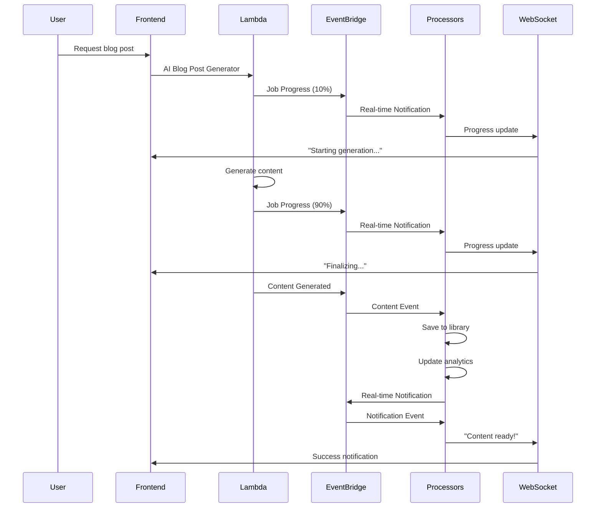
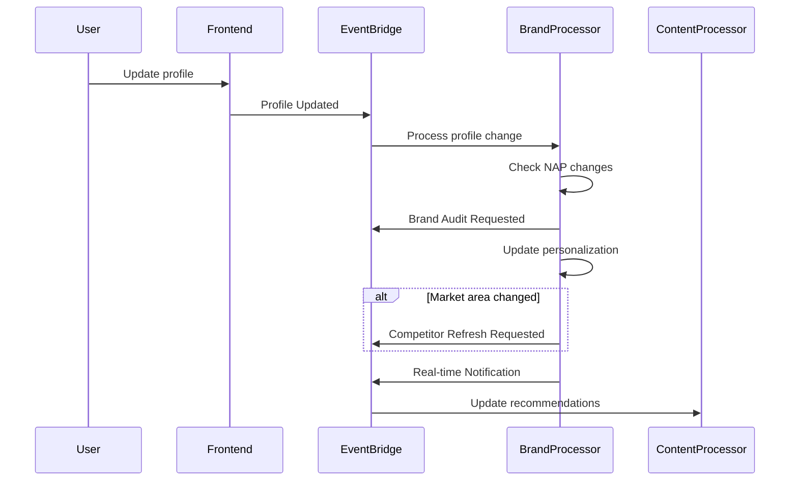

# Event-Driven Architecture Implementation

This document describes the event-driven architecture enhancements implemented for Bayon CoAgent, providing real-time user experiences and improved system responsiveness.

## Overview

The event-driven architecture uses AWS EventBridge as the central event bus to coordinate communication between microservices, enabling:

- **Real-time notifications** via WebSocket API
- **Asynchronous processing** of user actions
- **Decoupled microservices** communication
- **Automatic analytics tracking**
- **Intelligent content recommendations**

## Architecture Components

### 1. Event Bus (AWS EventBridge)

**Resource**: `ApplicationEventBus`

- Central hub for all application events
- Custom event bus for isolation from default events
- Supports event filtering and routing

### 2. Event Processors (AWS Lambda)

#### Content Event Processor

- **Function**: `ContentEventProcessorFunction`
- **Handler**: `src/lambda/event-processors/content-event-processor.ts`
- **Events**: Content Generated, Content Published, Content Updated
- **Actions**:
  - Save content to library
  - Update user analytics
  - Trigger content optimization
  - Send real-time notifications
  - Publish follow-up events (SEO analysis, social scheduling)

#### Brand Intelligence Processor

- **Function**: `BrandIntelligenceProcessorFunction`
- **Handler**: `src/lambda/event-processors/brand-intelligence-processor.ts`
- **Events**: Profile Updated, Competitor Discovered, Ranking Changed, Audit Completed
- **Actions**:
  - Trigger brand audits on NAP changes
  - Update content personalization
  - Refresh competitor analysis
  - Track ranking trends
  - Generate SEO recommendations

#### Research Event Processor

- **Function**: `ResearchEventProcessorFunction`
- **Handler**: `src/lambda/event-processors/research-event-processor.ts`
- **Events**: Research Query Completed, Report Generated, Knowledge Updated
- **Actions**:
  - Save research to knowledge base
  - Generate follow-up suggestions
  - Trigger content generation
  - Update research analytics
  - Schedule report sharing

#### Market Intelligence Processor

- **Function**: `MarketIntelligenceProcessorFunction`
- **Handler**: `src/lambda/event-processors/market-intelligence-processor.ts`
- **Events**: Trend Detected, Alert Triggered, Opportunity Identified, Price Change Detected
- **Actions**:
  - Notify affected users
  - Update market analytics
  - Trigger trend-based content
  - Calculate opportunity scores
  - Update property valuations

#### User Event Processor

- **Function**: `UserEventProcessorFunction`
- **Handler**: `src/lambda/event-processors/user-event-processor.ts`
- **Events**: User Registered, Subscription Changed, Usage Updated, Profile Updated
- **Actions**:
  - Initialize user onboarding
  - Adjust feature access
  - Track usage limits
  - Update recommendations
  - Trigger plan-specific workflows

#### Real-time Notification Processor

- **Function**: `RealtimeNotificationProcessorFunction`
- **Handler**: `src/lambda/event-processors/realtime-notification-processor.ts`
- **Events**: Real-time Notification, Job Progress Update
- **Actions**:
  - Send WebSocket notifications
  - Manage connection lifecycle
  - Store progress updates
  - Handle connection cleanup

### 3. WebSocket API

**Resource**: `WebSocketApi`

- Real-time communication with frontend
- Connection/disconnection handling
- Message broadcasting to connected users
- Automatic connection cleanup for stale connections

### 4. Event Publishing Utility

**Module**: `src/aws/events/event-publisher.ts`

- Centralized event publishing service
- Type-safe event definitions
- Batch event publishing
- Convenience methods for common events

## Event Flow Examples

### Content Generation Flow



### Brand Intelligence Flow



## Event Types and Schemas

### Studio Events

#### Content Generated

```typescript
{
  source: "bayon.coagent.studio",
  detailType: "Content Generated",
  detail: {
    userId: string,
    contentId: string,
    contentType: "blog-post" | "social-media" | "listing-description",
    title: string,
    content: string,
    metadata: {
      generationTime: number,
      tokensUsed: number,
      model: string,
      prompt: string
    },
    timestamp: string
  }
}
```

#### Job Progress Update

```typescript
{
  source: "bayon.coagent.studio",
  detailType: "Job Progress Update",
  detail: {
    userId: string,
    jobId: string,
    jobType: string,
    progress: number, // 0-100
    status: "started" | "processing" | "completed" | "failed",
    message: string,
    estimatedTimeRemaining?: number,
    timestamp: string
  }
}
```

### Brand Events

#### Profile Updated

```typescript
{
  source: "bayon.coagent.brand",
  detailType: "Profile Updated",
  detail: {
    userId: string,
    profileData: any,
    changes: string[],
    timestamp: string
  }
}
```

#### Competitor Discovered

```typescript
{
  source: "bayon.coagent.brand",
  detailType: "Competitor Discovered",
  detail: {
    userId: string,
    competitorId: string,
    competitorData: any,
    discoveryMethod: string,
    timestamp: string
  }
}
```

### Research Events

#### Research Query Completed

```typescript
{
  source: "bayon.coagent.research",
  detailType: "Research Query Completed",
  detail: {
    userId: string,
    queryId: string,
    query: string,
    results: any,
    sources: string[],
    timestamp: string
  }
}
```

### Market Events

#### Trend Detected

```typescript
{
  source: "bayon.coagent.market",
  detailType: "Trend Detected",
  detail: {
    userId?: string,
    trendType: string,
    trendData: any,
    confidence: number,
    affectedUsers?: string[],
    timestamp: string
  }
}
```

### User Events

#### User Registered

```typescript
{
  source: "bayon.coagent.user",
  detailType: "User Registered",
  detail: {
    userId: string,
    email: string,
    registrationMethod: string,
    referralSource?: string,
    timestamp: string
  }
}
```

## Real-time Notifications

### WebSocket Connection

Frontend connects to WebSocket API with user authentication:

```javascript
const ws = new WebSocket(`${WEBSOCKET_ENDPOINT}?userId=${userId}`);

ws.onmessage = (event) => {
  const notification = JSON.parse(event.data);

  switch (notification.type) {
    case "notification":
      showNotification(notification.message, notification.data);
      break;
    case "progress":
      updateProgressBar(notification.jobId, notification.progress);
      break;
  }
};
```

### Notification Types

- **content_generated**: Content creation completed
- **research_completed**: Research query finished
- **competitor_alert**: New significant competitor found
- **ranking_alert**: Keyword ranking changed significantly
- **usage_warning**: Approaching usage limits
- **trend_alert**: New market trend detected

## Deployment

### Prerequisites

1. AWS CLI configured
2. SAM CLI installed
3. Node.js and npm/pnpm

### Deploy Event-Driven Enhancements

```bash
# Deploy to development
npm run deploy:event-driven development

# Deploy to production
npm run deploy:event-driven production
```

### Test the Implementation

```bash
# Run comprehensive test
npm run test:event-driven

# Manual testing
tsx scripts/test-event-driven-architecture.ts
```

## Monitoring and Observability

### CloudWatch Metrics

- **EventBridge**: Event publishing rates, rule invocations
- **Lambda**: Function duration, error rates, concurrent executions
- **WebSocket API**: Connection counts, message rates
- **DynamoDB**: Read/write capacity, throttling

### CloudWatch Logs

Each event processor logs:

- Event processing start/completion
- Error details with context
- Performance metrics
- Business logic outcomes

### X-Ray Tracing

Distributed tracing across:

- Event publishing
- Event processing
- Database operations
- External API calls

### Dead Letter Queues

Failed events are sent to DLQ for:

- Manual inspection
- Retry processing
- Error analysis

## Performance Optimizations

### Event Processing

- **Parallel Processing**: Multiple event processors handle different event types
- **Batch Processing**: EventBridge supports batch event publishing
- **Retry Logic**: Automatic retries with exponential backoff
- **Circuit Breaker**: Prevents cascade failures

### WebSocket Optimization

- **Connection Pooling**: Efficient connection management
- **Message Batching**: Combine multiple notifications
- **Selective Broadcasting**: Only notify relevant users
- **Connection Cleanup**: Remove stale connections automatically

### Database Optimization

- **Single Table Design**: Efficient DynamoDB access patterns
- **GSI Usage**: Optimized queries for analytics and reporting
- **TTL**: Automatic cleanup of temporary data
- **Batch Operations**: Reduce API calls

## Security Considerations

### Event Security

- **IAM Roles**: Least privilege access for event processors
- **Event Filtering**: Only process authorized events
- **Data Validation**: Validate all event payloads
- **Encryption**: Events encrypted in transit and at rest

### WebSocket Security

- **Authentication**: User ID validation on connection
- **Authorization**: User-specific message filtering
- **Rate Limiting**: Prevent abuse and spam
- **Connection Limits**: Per-user connection quotas

## Troubleshooting

### Common Issues

1. **Events Not Processing**

   - Check EventBridge rules are enabled
   - Verify Lambda permissions
   - Check CloudWatch Logs for errors

2. **WebSocket Connections Failing**

   - Verify API Gateway deployment
   - Check connection handler logs
   - Validate user authentication

3. **High Latency**
   - Monitor Lambda cold starts
   - Check DynamoDB throttling
   - Review event processing logic

### Debug Commands

```bash
# Check EventBridge metrics
aws cloudwatch get-metric-statistics \
  --namespace AWS/Events \
  --metric-name InvocationsCount \
  --start-time 2024-01-01T00:00:00Z \
  --end-time 2024-01-01T23:59:59Z \
  --period 3600 \
  --statistics Sum

# View Lambda logs
sam logs --stack-name bayon-coagent-development --tail

# Check DLQ messages
aws sqs receive-message --queue-url <DLQ_URL>
```

## Future Enhancements

### Planned Features

1. **Event Replay**: Replay events for debugging and recovery
2. **Event Sourcing**: Complete event history for audit trails
3. **Advanced Analytics**: ML-powered event pattern analysis
4. **Cross-Region Replication**: Multi-region event processing
5. **Event Versioning**: Schema evolution support

### Scalability Improvements

1. **Event Streaming**: Kinesis integration for high-volume events
2. **Caching Layer**: Redis for frequently accessed data
3. **CDN Integration**: Global WebSocket distribution
4. **Auto-scaling**: Dynamic Lambda concurrency adjustment

## Best Practices

### Event Design

- Use descriptive event names
- Include all necessary context in event payload
- Keep events immutable
- Version event schemas
- Use consistent timestamp formats

### Error Handling

- Implement comprehensive error logging
- Use structured error responses
- Set appropriate retry policies
- Monitor DLQ for failed events
- Implement circuit breakers for external dependencies

### Performance

- Minimize event payload size
- Use batch operations where possible
- Implement efficient database access patterns
- Monitor and optimize Lambda memory allocation
- Use connection pooling for external services

### Security

- Validate all event inputs
- Use least privilege IAM policies
- Encrypt sensitive data in events
- Implement rate limiting
- Monitor for suspicious event patterns
